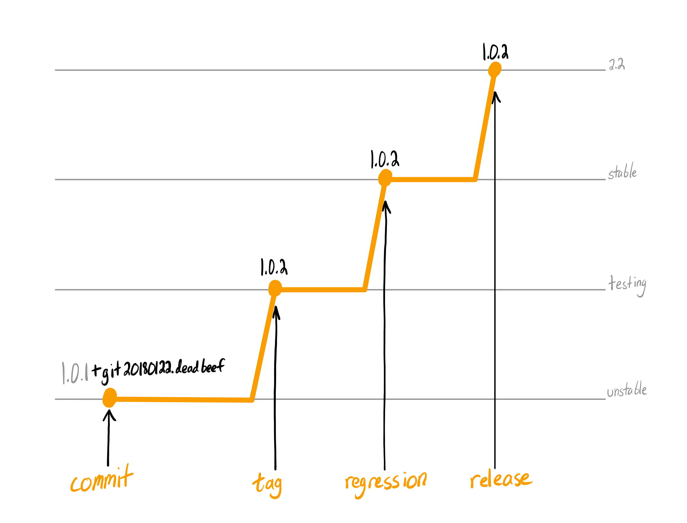

# Concourse CI/CD

https://concourse.k8s.openswitch.net/beta/dashboard

Concourse is a container-based CI/CD server. It is currently used for
continuous delivery. We build our own [generic CI/CD docker image](https://hub.docker.com/r/opxhub/concourse/).

## Debian Pipeline

Our [debian pipeline](../../concourse/ci/debian.pipeline.yml) is a
parameterized pipline suitable for any OPX debian package. The `Makefile` is
used to fill parameters. Simply run `make opx-logging` to create/update the
`opx-logging` pipeline.

This pipeline runs on two triggers.

### New Commit Trigger

On every commit to the `master` branch, a pipeline instance is triggered. This
builds the package and publishes it to the unstable distribution on
[Bintray](https://bintray.com/open-switch/opx-apt). The package version is
amended with `+git$(date +%Y%m%d).$(git rev-parse --short HEAD)`.

### New Tag Trigger

On every `debian/*` tag to the `master` branch, a pipeline instance is
triggered. This builds the package and publishes it to the testing
distribution on [Bintray](https://bintray.com/open-switch/opx-apt).

Once a package has entered testing, it can be manually promoted to stable. When
installers are released, a snapshot is taken of the stable distribution.

## opx-build Pipeline

We have a second pipeline used for building and delivering our [package build
docker image](https://hub.docker.com/r/opxhub/build/). For every commit, an
image for each distribution is built and published.

# Using OPX Debian Packages

We currently use two Debian repositories. One, `dl.bintray.com/open-switch/opx-apt`, holds all open-source packages. The other, `dell-networking.bintray.com/opx-apt`, holds all closed-source packages. Multiple distributions of packages are available.

Choose the appropriate distribution for your required release.

`deb http://dell-networking.bintray.com/opx-apt unstable main`

* `unstable`: packages built from the HEAD of each repository
* `testing`: packages built from all `debian/*` tags of each repository
* `stable`: packages manually promoted from testing after passing regression
* `2.0`: packages included in the initial OPX release
* `2.X`: packages included in the **2.X** OPX release (change the X to your release)

